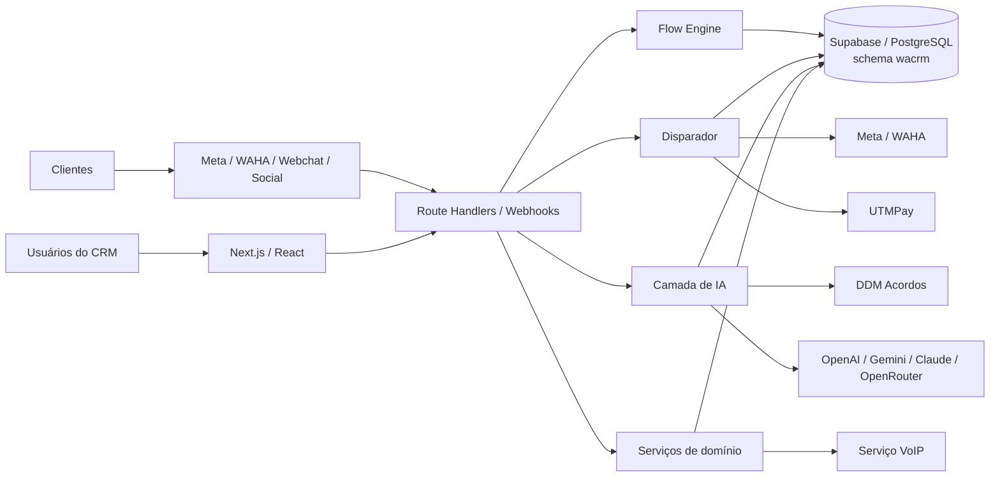

# CRM DDM

> Plataforma omnichannel de atendimento, cobrança e automação do Grupo DDM, com operação de WhatsApp, fluxos visuais, agentes de IA, disparos em lote, monitoramento e relatórios sobre uma base central no Supabase.

[](https://github.com/iaeautomacao-lgtm/CRM-DDM/actions/workflows/ci.yml)
[](https://nextjs.org/)
[](https://www.typescriptlang.org/)
[](https://supabase.com/)
[](./LICENSE)

O CRM DDM centraliza canais de atendimento, contexto do cliente e automações operacionais em uma única aplicação. O objetivo é reduzir fragmentação entre atendimento humano, campanhas, cobrança automatizada e observabilidade, mantendo rastreabilidade de cada conversa e execução.

## Visão geral

O produto principal é uma aplicação **Next.js 16 + React 19 + TypeScript**, conectada ao **Supabase** no schema `wacrm`. Além do frontend e das APIs do CRM, o repositório contém motores de fluxo e disparo, integrações de WhatsApp, camada de IA, serviços de Webchat, relatórios e um serviço VoIP auxiliar em Go.

### Capacidades principais

| Área | O que o CRM oferece |
| --- | --- |
| Atendimento | Inbox compartilhada, atribuição por agente/equipe, histórico, notas, tabulações, respostas rápidas e transferência |
| Omnichannel | WhatsApp via Meta Cloud API e WAHA, Webchat, Instagram/Messenger e fundação para múltiplos canais |
| IA | Agente conversacional, tool calling, análise de sentimento, handoff para humanos e recuperação de falhas |
| Fluxos | Builder visual com nós de envio, condições, waits, IA, handoff, chamadas HTTP e encadeamento de fluxos |
| Disparador | Importação de base, segmentação, fila de envio, templates, retries, idempotência, blacklist, métricas, UTM e callbacks |
| Gestão | Contatos, equipes, usuários, permissões, pipelines, templates e configurações por conta |
| Observabilidade | Monitoramento operacional, logs, auditoria, relatórios, métricas de IA/fluxos e health checks |
| API | API REST autenticada por chaves com escopos em `/api/v1` |
| Voz | Serviço VoIP auxiliar em Go com integração ao CRM |

## Arquitetura em alto nível



Detalhes de componentes, fronteiras e fluxos estão em [docs/architecture.md](./docs/architecture.md).

## Stack

- **Aplicação:** Next.js 16, React 19, TypeScript, App Router.
- **UI:** Tailwind CSS 4, shadcn, Base UI, Lucide.
- **Banco e autenticação:** Supabase/PostgreSQL, Supabase Auth, Storage e Realtime.
- **Mensageria:** Meta WhatsApp Cloud API e WAHA.
- **IA:** OpenAI e suporte de infraestrutura para Gemini, Claude e OpenRouter/Hermes.
- **Testes:** Vitest; testes de unidade, integração SQL e cenários de stress.
- **CI:** GitHub Actions com lint, typecheck, testes, build principal, subprojeto do disparador e VoIP.
- **VoIP:** serviço auxiliar em Go.
- **Runtime de produção atual:** Node.js 20 com processo reiniciado por Passenger/cPanel.

## Início rápido

Pré-requisitos:

- Node.js 20+
- npm 10
- projeto Supabase compatível com o schema esperado
- credenciais dos canais e integrações que serão utilizadas

```bash
git clone https://github.com/iaeautomacao-lgtm/CRM-DDM.git
cd CRM-DDM

npm ci
cp .env.local.example .env.local
npm run schema:check
npm run dev
```

Abra `http://localhost:3000`.

> `schema:check` consulta o banco configurado e bloqueia o deploy quando objetos críticos do schema não estão disponíveis. Para um ambiente novo, veja [docs/getting-started.md](./docs/getting-started.md) antes de executar migrations.

## Configuração

O arquivo [`.env.local.example`](./.env.local.example) documenta as variáveis suportadas. As mais importantes para o runtime principal são:

```env
NEXT_PUBLIC_SUPABASE_URL=
NEXT_PUBLIC_SUPABASE_ANON_KEY=
SUPABASE_SERVICE_ROLE_KEY=
ENCRYPTION_KEY=
META_APP_SECRET=
```

Recursos adicionais exigem variáveis próprias, como `DDM_ACORDOS_API_TOKEN`, chaves de LLM, `UTM_API_KEY`, `WAHA_WEBHOOK_SECRET`, `VOIP_SERVICE_SECRET` e segredos dos crons.

Veja a matriz completa em [docs/configuration.md](./docs/configuration.md).

## Banco de dados e migrations

- O schema de aplicação é `wacrm`; não assuma o schema `public`.
- As migrations versionadas ficam em [`supabase/migrations/`](./supabase/migrations/).
- Em ambientes existentes, o **schema live deve ser verificado antes de escrever ou aplicar uma migration**.
- `all_migrations.sql` é um artefato consolidado histórico e não substitui a revisão do histórico versionado.
- O deploy executa `npm run schema:check` antes do build.

Mais detalhes: [docs/database.md](./docs/database.md).

## Qualidade e testes

Antes de abrir um PR:

```bash
npm run lint
npm run typecheck
npm test
npm run build
```

Comandos úteis:

| Comando | Finalidade |
| --- | --- |
| `npm run dev` | desenvolvimento local |
| `npm run lint` | ESLint |
| `npm run typecheck` | validação TypeScript sem emissão |
| `npm test` | suíte Vitest |
| `npm run build` | build de produção |
| `npm run schema:check` | compatibilidade do banco |
| `npm run stress:e2e` | cenários de stress end-to-end |

O workflow de CI também compila os subprojetos em `disparador/` e executa testes/build do serviço `voip/`.

## Deploy

O repositório possui automação cPanel em [`.cpanel.yml`](./.cpanel.yml). A sequência de produção é deliberadamente simples e stateless:

```bash
nvm use 20.19.0
npm install --no-audit --no-fund
npm run schema:check
npm run build
touch tmp/restart.txt
```

Jobs recorrentes não devem depender de `setInterval` dentro do processo da aplicação. Fluxos recorrentes usam endpoints de cron protegidos e mecanismos persistidos no banco.

Runbook: [docs/operations.md](./docs/operations.md).

## Documentação

A documentação técnica está organizada em [`docs/`](./docs/README.md):

- [Getting started](./docs/getting-started.md)
- [Arquitetura](./docs/architecture.md)
- [Configuração e variáveis de ambiente](./docs/configuration.md)
- [Banco de dados e migrations](./docs/database.md)
- [Integrações](./docs/integrations.md)
- [Operação e deploy](./docs/operations.md)
- [Troubleshooting](./docs/troubleshooting.md)
- [API pública](./docs/public-api.md)
- [VoIP](./voip/README.md)
- [Disparador auxiliar](./disparador/README.md)

## Estrutura do repositório

```text
CRM-DDM/
├── src/
│   ├── app/
│   │   ├── (dashboard)/     # páginas autenticadas
│   │   └── api/             # APIs, webhooks e crons
│   ├── components/          # componentes de UI
│   ├── hooks/               # hooks React
│   └── lib/
│       ├── ai/              # LLM, ferramentas e handoff
│       ├── flows/           # motor e validação de fluxos
│       ├── disparador/      # campanhas, fila e segurança de envio
│       ├── whatsapp/        # Meta/WAHA
│       ├── intelligence/    # métricas e ferramentas analíticas
│       └── webchat/         # sessões e mensagens web
├── supabase/migrations/     # evolução do schema wacrm
├── docs/                    # documentação técnica
├── tests/                   # stress e cenários auxiliares
├── disparador/              # serviços auxiliares do disparador
└── voip/                    # serviço VoIP em Go
```

## Segurança

O projeto processa dados de clientes e credenciais de provedores. Regras mínimas:

- nunca commitar segredos, tokens ou service-role keys;
- manter credenciais somente no ambiente do servidor;
- respeitar RLS e escopo por `account_id`;
- validar assinatura de webhooks;
- evitar logs com PII/segredos;
- rotacionar credenciais após qualquer suspeita de vazamento;
- reportar vulnerabilidades de forma privada.

Consulte [`.github/SECURITY.md`](./.github/SECURITY.md).

## Contribuição

Fluxo recomendado:

1. branch curta a partir de `main`;
2. mudança focada;
3. testes locais;
4. PR com impacto, riscos e plano de validação;
5. CI verde antes do merge.

Detalhes em [CONTRIBUTING.md](./CONTRIBUTING.md).

## Licença e origem

O repositório preserva a licença MIT do projeto-base e evolui o produto para as necessidades operacionais do Grupo DDM. Consulte [LICENSE](./LICENSE) para os termos aplicáveis.
