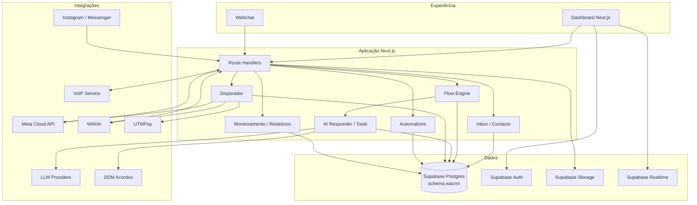

# Arquitetura

## Objetivo

O CRM DDM é uma aplicação omnichannel orientada a eventos. Mensagens recebidas entram por webhooks/canais, são normalizadas, persistidas no Supabase e então podem ser consumidas por fluxo, IA, automações, monitoramento e atendimento humano.

O sistema privilegia três propriedades:

- **persistência antes de automação:** conversas, mensagens, runs e filas ficam no banco;
- **idempotência:** webhooks, disparos e callbacks possuem guards para evitar efeitos duplicados;
- **account scoping:** dados e operações são isolados por conta/equipe e protegidos por RLS ou validação server-side.

## Componentes

## Camada web

O App Router é dividido entre:

- `src/app/(dashboard)`: experiência autenticada;
- `src/app/api`: APIs internas, API pública, webhooks, callbacks e crons;
- `src/app/w` e `src/app/api/webchat`: experiência pública do Webchat;
- `src/app/auth` e `src/app/(auth)`: autenticação.

A camada HTTP deve validar autenticação, conta, payload e permissões antes de chamar serviços de domínio.

## Domínios principais

### Conversas e canais

`conversations` e `messages` formam o registro central de atendimento. O canal é representado por `channel_type` e por configuração específica quando necessário.

O mesmo modelo de conversa alimenta Inbox, métricas, IA, flows e relatórios. Isso evita manter históricos paralelos por provedor.

### Flow Engine

`src/lib/flows/engine.ts` coordena execuções persistidas em `flow_runs` e eventos em `flow_run_events`.

O motor suporta espera, loops de IA, condições, handoff e chamadas externas sem depender de um worker residente em memória. Debounce e guards de concorrência vivem no banco quando precisam sobreviver a múltiplas requisições.

### IA

`src/lib/ai` concentra:

- seleção de provider e geração;
- tool calling;
- recuperação/classificação de falhas de ferramentas;
- tags de saída e handoff;
- sentimento e enriquecimento de conversa.

O agente pode ser usado dentro do flow engine. Resultados de ferramentas devem ser tratados como dados não confiáveis: HTTP 2xx não garante sucesso de negócio.

### Disparador

O disparador principal vive em `src/lib/disparador` e `src/app/api/disparador`.

A fila de envio possui estados persistidos, limites por canal/campanha, retries, marcações idempotentes, reconciliação de recibos e callback outbox. Isso reduz risco de duplicidade quando o processo reinicia ou o provedor demora a confirmar o status.

### Inteligência e relatórios

`src/lib/intelligence` implementa fatos, métricas e ferramentas analíticas. `src/lib/relatorios` e as rotas de `/api/relatorios` expõem relatórios operacionais e exportações.

### VoIP

`voip/` é um serviço Go separado, validado pela CI própria. O CRM fala com ele por API e segredo server-side.

## Persistência

O projeto usa Supabase com schema `wacrm`.

Padrões relevantes:

- RLS nas tabelas acessadas por usuários autenticados;
- service role apenas em código server-side;
- `account_id` como fronteira de tenancy;
- funções RPC para operações que precisam ser atômicas;
- eventos/runs para rastrear automações e IA;
- logs/auditoria separados de dados de domínio.

Leia [database.md](./database.md) antes de alterar schema.

## Concorrência e idempotência

Pontos sensíveis:

- webhooks podem ser reenviados pelo provedor;
- a mesma mensagem pode chegar por caminhos concorrentes;
- um cron pode sobrepor outra execução;
- uma chamada externa pode terminar depois de timeout local.

Por isso existem mecanismos como:

- `claim_ai_reply` e `release_ai_reply`;
- `bump_ai_agent_debounce`;
- locks de cron;
- chaves/ledgers de envio;
- estados de fila transicionais;
- outbox de callbacks;
- deduplicação por `message_id`.

Antes de remover um guard, identifique a condição de corrida que ele previne.

## Segurança

Fronteiras principais:

1. navegador ↔ Next.js;
2. provedores externos ↔ webhooks;
3. Next.js ↔ Supabase service role;
4. CRM ↔ APIs externas;
5. CRM ↔ serviço VoIP.

Credenciais devem permanecer no servidor. Webhooks precisam de assinatura/segredo, e logs não devem persistir tokens ou payloads sensíveis desnecessários.

## Decisões de runtime

O deployment principal usa processo Node reiniciável. Isso significa que timers em memória não são mecanismo de confiabilidade. Tarefas agendadas devem usar crons stateless + estado persistido.

Veja [operations.md](./operations.md).
