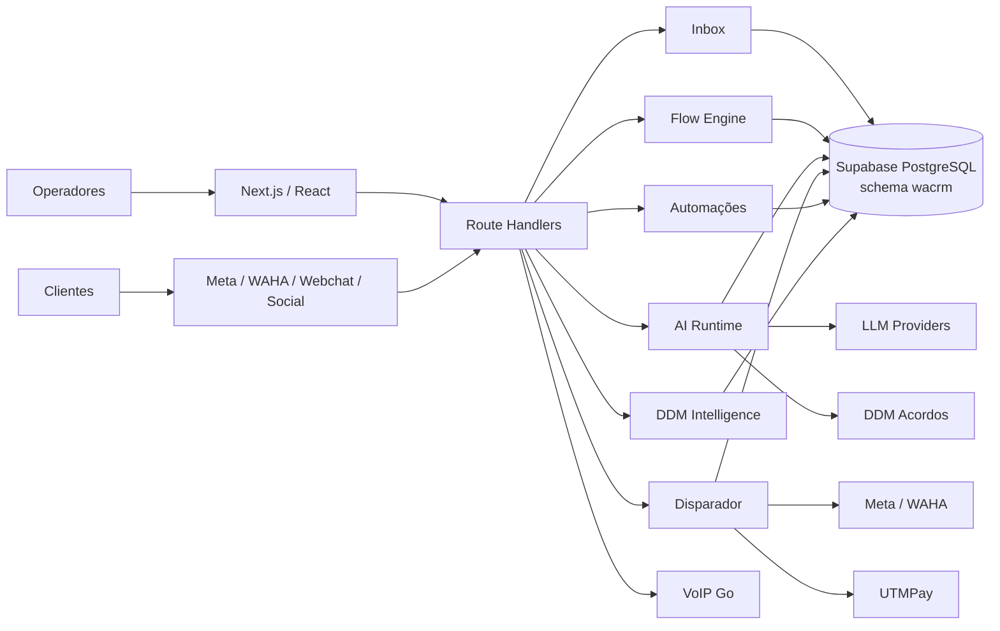

# Arquitetura da V1

## Visão geral

A V1 é um monorepo modular centrado em Next.js e Supabase. A maior parte do domínio vive no app principal, enquanto estado crítico e coordenação ficam persistidos no PostgreSQL.



## Princípios

### Estado persistido

Runs, filas, locks, claims, receipts, callbacks e pending executions ficam no banco. O processo Node pode reiniciar sem ser a fonte exclusiva do estado.

### Idempotência

Mecanismos relevantes:

- `messages.message_id`;
- `ai_reply_intents` + claim/release;
- `send_operations`;
- `claim_dispatch_item`;
- receipts;
- callback outbox;
- cron locks.

### Multi-tenancy

`account_id` é a fronteira principal. O isolamento combina RLS, guards server-side e team scoping.

### Providers explícitos

Meta, WAHA, Webchat/Social e os providers de LLM mantêm bifurcações quando o contrato difere.

## Stack

- Next.js 16.2.6
- React 19.2.4
- TypeScript 6
- Node >=20; produção 20.19.0
- Supabase JS 2.108.2
- Tailwind 4
- Vitest 4

## Estrutura

```text
src/
├── app/(dashboard)
├── app/api
├── components
├── hooks
└── lib
    ├── ai
    ├── auth
    ├── automations
    ├── channels
    ├── conversations
    ├── disparador
    ├── flows
    ├── inbox
    ├── intelligence
    ├── relatorios
    ├── storage
    ├── webchat
    └── whatsapp
```

Componentes auxiliares: `disparador/backend`, `disparador/frontend`, `voip/`, `tests/stress/` e `scripts/`.

## Deploy

O deploy cPanel:

```text
nvm use 20.19.0
npm install --no-audit --no-fund
npm run schema:check
npm run build
touch tmp/restart.txt
```

Jobs recorrentes confiáveis não devem depender de timers em memória.
